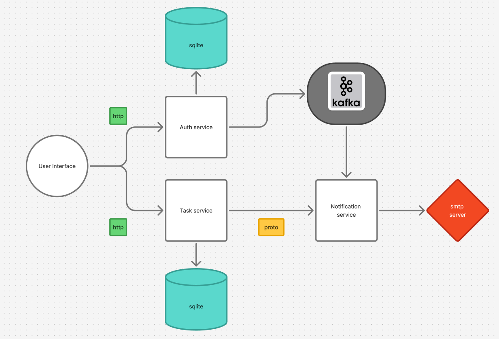

## Описание
<h4>Task scheduler - демонстранционное микросервисное приложение бэкенда для создания заметок, отслеживания выполнения и уведомлений</h4>

## Требования
1) Apache Kafka
2) golang v1.25
3) Git

## Установка
1) Открыть терминал, перейти в директорию для проекта
2) Выполнить команду: `git clone https://github.com/Dicluu/go_task_scheduler.git` или распокаватьт скачанный архив в директорию
3) Перейти в директорию каждого микросервиса и сконфигурировать согласно README.md каждого микросервиса

## Схема приложения

## Используемые технологии
1) Golang v1.25
2) Sqlite
3) Apache kafka
4) Go-chi